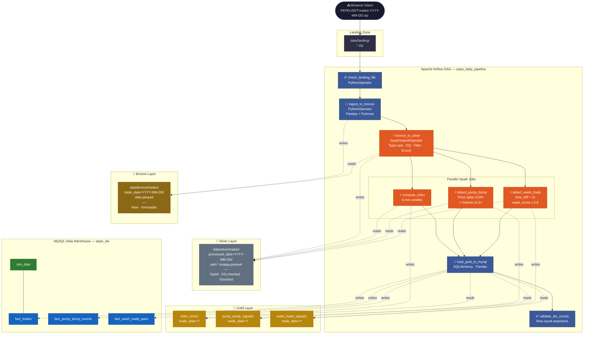

# pepe-pipeline

A production-grade data pipeline for detecting market manipulation in **PEPEUSDT** cryptocurrency trades. Ingests raw Binance Vision trade data, processes it through a Medallion architecture (Bronze → Silver → Gold), and loads manipulation signals into a MySQL data warehouse for analysis.

Detects two manipulation patterns: **Pump & Dump** events (price spikes ≥10% followed by a sharp drop within 60 minutes) and **Wash Trading** (suspicious buy/sell pairs occurring within milliseconds at near-identical prices and quantities).

---

## Pipeline



---

## Stack

| Component | Technology | Version |
|-----------|-----------|---------|
| Orchestration | Apache Airflow | 2.8.1 |
| Distributed Processing | Apache Spark (PySpark) | 3.5.0 |
| Ingestion / Load | Pandas + PyArrow + SQLAlchemy | — |
| Data Warehouse | MySQL | 8.0 |
| Airflow Metadata DB | PostgreSQL | 15 |
| Containerisation | Docker Compose | v2 |
| Storage Format | Apache Parquet (Snappy) | — |

---

## Architecture

### Medallion Layers

| Layer | Format | Location | Purpose |
|-------|--------|----------|---------|
| Bronze | Parquet | `data/bronze/trades/trade_date=*/` | Raw ingest, immutable |
| Silver | Parquet | `data/silver/trades/processed_date=*/` | Cleaned, typed, DQ-validated, enriched |
| Gold | Parquet | `data/gold/*/trade_date=*/` | Detection signals + OHLCV candles |
| DW | MySQL | `pepe_dw` database | Star schema for reporting |

### Services

```
postgres          ← Airflow metadata DB
airflow-init      ← DB migration + create admin user (runs once)
airflow-webserver ← UI  :8080
airflow-scheduler ← Task execution (LocalExecutor)
spark-master      ← Standalone cluster coordinator  :7077  UI :8090
spark-worker      ← Executor (2 cores, 4 GB RAM)
mysql             ← Data warehouse  :3306
```

---

## Quick Start

### Prerequisites
- Docker Desktop ≥ 24
- Docker Compose v2

### 1. Clone and configure

```bash
git clone <repo-url>
cd pepe-pipeline
cp .env.example .env
```

Edit `.env` — set strong passwords and generate a Fernet key:

```bash
python -c "from cryptography.fernet import Fernet; print(Fernet.generate_key().decode())"
# paste output as FERNET_KEY in .env
```

### 2. Build and start all services

```bash
docker compose build   # ~5 min first time — compiles Python 3.11 for Spark
docker compose up -d
```

| Service | URL |
|---------|-----|
| Airflow UI | http://localhost:8080 (admin / admin) |
| Spark Master UI | http://localhost:8090 |
| MySQL | localhost:3306 |

### 3. Set Airflow Variables

In the Airflow UI → Admin → Variables, add:

| Key | Value |
|-----|-------|
| `MYSQL_HOST` | `mysql` |
| `MYSQL_USER` | `pepe_user` |
| `MYSQL_PASS` | *(MYSQL_PASSWORD from .env)* |
| `MYSQL_DB` | `pepe_dw` |

The `spark_default` connection is created automatically by `airflow-init`.

---

## Adding Data

1. Download from [Binance Vision](https://data.binance.vision/?prefix=data/spot/daily/trades/PEPEUSDT/):
   ```
   PEPEUSDT-trades-YYYY-MM-DD.zip
   ```
2. Place in `data/landing/`:
   ```bash
   cp ~/Downloads/PEPEUSDT-trades-2026-04-13.zip data/landing/
   ```

---

## Running the Pipeline

### Airflow UI

1. Open http://localhost:8080
2. Toggle `pepe_daily_pipeline` **ON**
3. Click **Trigger DAG w/ config** → `{"ds": "2026-04-13"}`

### CLI

```bash
docker compose exec airflow-scheduler \
  airflow dags trigger pepe_daily_pipeline --conf '{"ds": "2026-04-13"}'
```

### Check results

```bash
# Task states
docker compose exec airflow-scheduler \
  airflow tasks states-for-dag-run pepe_daily_pipeline <run_id>

# Row counts in MySQL
docker compose exec mysql \
  mysql -u pepe_user -p pepe_dw \
  -e "SELECT COUNT(*) FROM fact_trades WHERE processed_date = '2026-04-13';"
```

---

## Detection Methodology

### Pump & Dump

A 5-minute OHLCV candle is flagged as a **pump** when:
- Price change ≥ **+10%** vs previous candle
- Volume ≥ **2.5×** the 7-period rolling average volume

Confirmed as a **dump** if the minimum close in the next **12 candles (60 min)** drops ≤ **−7%** from the pump peak.

| Severity | Condition |
|----------|-----------|
| `HIGH` | pump ≥ 20% |
| `MEDIUM` | pump 10–19% |
| `LOW` | pump < 10% |

### Wash Trading

A buy/sell pair is flagged when all three hold simultaneously:

| Filter | Threshold |
|--------|-----------|
| `time_diff_ms` | < 1 000 ms |
| `price_diff_pct` | < 0.1 % |
| `qty_similarity_pct` | > 90 % |

Scored as a weighted composite:

```
wash_score = time_score  × 0.40
           + price_score × 0.35
           + qty_score   × 0.25
```

Only pairs with `wash_score ≥ 0.80` are written to the DW.

**Performance:** trades are bucketed into 1-second windows and joined only within the same bucket — avoids an O(n²) cross-join on millions of rows.

---

## MySQL Data Warehouse Schema

```
dim_date ─────────────── fact_trades          (FK: date_id)
dim_time_window          fact_pump_dump_events
                         fact_wash_trade_pairs
```

See [`sql/init.sql`](sql/init.sql) for full DDL.

---

## Project Structure

```
pepe-pipeline/
├── Dockerfile.airflow          # Airflow image: Python 3.11 + Java 17 + providers
├── Dockerfile.spark            # Spark image: Python 3.11 compiled from source
├── docker-compose.yml          # All services
├── .env.example                # Environment variable template
├── dags/
│   └── pepe_daily_pipeline.py  # Airflow DAG
├── spark_jobs/
│   ├── bronze_to_silver.py     # Schema casting + DQ + enrichment
│   ├── compute_ohlcv.py        # 5-min OHLCV candles
│   ├── detect_pump_dump.py     # Pump & Dump detection
│   └── detect_wash_trade.py    # Wash Trade detection
├── dq/
│   └── quality_checks.py       # Reusable PySpark DQ functions
├── sql/
│   └── init.sql                # MySQL star schema DDL + dim_date seed
├── DOCUMENTATION.md            # In-depth project documentation (Thai)
└── data/
    ├── landing/                # Place downloaded ZIPs here
    ├── bronze/                 # Auto-populated by pipeline
    ├── silver/                 # Auto-populated by pipeline
    └── gold/                   # Auto-populated by pipeline
```

---

## Troubleshooting

| Symptom | Check |
|---------|-------|
| `PYTHON_VERSION_MISMATCH` | Ensure `PYSPARK_PYTHON=/usr/local/bin/python3.11` is set in Airflow env |
| `PATH_NOT_FOUND` in Spark job | Verify `./data:/data` volume is mounted in both Airflow and Spark services |
| Airflow UI shows "Could not read served logs" | Log display issue only — check actual state via `airflow tasks states-for-dag-run` |
| Spark worker not registering | `docker compose logs spark-worker` |
