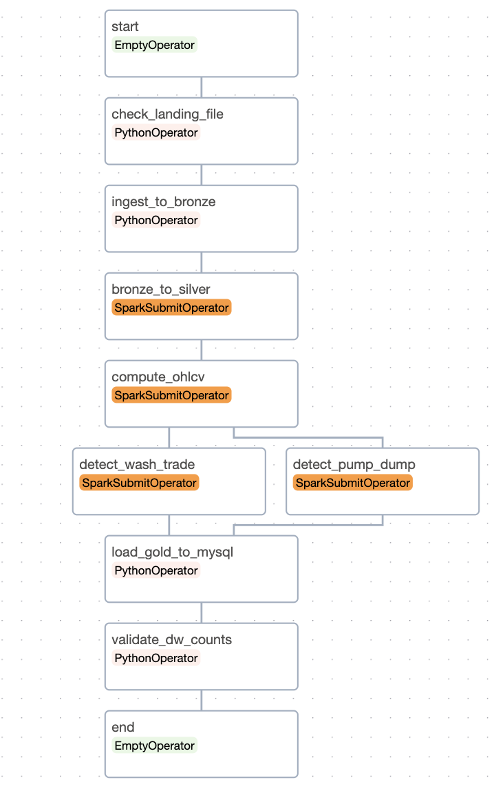

# PEPEUSDT Market Manipulation Detection Pipeline

Pipeline สำหรับตรวจจับการบิดเบือนราคาใน PEPEUSDT โดยรับข้อมูลเทรดจาก Binance Vision
ประมวลผลผ่าน Medallion Architecture (Bronze → Silver → Gold) และจัดเก็บ signals ลงใน MySQL Data Warehouse

ตรวจจับ 2 รูปแบบ:
- **Pump & Dump** — ราคา spike ขึ้นจาก 30-min rolling low ≥ 1.5% พร้อม volume ผิดปกติ แล้วตามด้วยการลง ≥ 1% ใน 60 นาที
- **Wash Trading** — คู่ buy/sell ที่เกิดห่างกัน < 1 วินาที ราคาต่างกัน < 0.1% ปริมาณใกล้กัน > 90%

---

## Pipeline Graph



Pipeline ทำงานผ่าน Apache Airflow DAG ชื่อ `pepe_daily_pipeline` มีทั้งหมด 8 tasks:

| Task | Operator | หน้าที่ |
|------|----------|---------|
| `start` | EmptyOperator | จุดเริ่มต้น |
| `check_landing_file` | PythonOperator | ตรวจว่าไฟล์ ZIP อยู่ใน landing/ หรือยัง |
| `ingest_to_bronze` | PythonOperator | แตก ZIP → อ่าน CSV → เขียน Parquet ดิบ |
| `bronze_to_silver` | SparkSubmitOperator | Cast types, DQ checks, filter, enrich columns |
| `compute_ohlcv` | SparkSubmitOperator | รวม trades เป็น OHLCV candle ทุก 5 นาที |
| `detect_wash_trade` | SparkSubmitOperator | ตรวจ wash trading pairs (รันคู่กับ pump dump) |
| `detect_pump_dump` | SparkSubmitOperator | ตรวจ pump & dump events (รันคู่กับ wash trade) |
| `load_gold_to_mysql` | PythonOperator | โหลดผลลัพธ์ทั้งหมดเข้า MySQL |
| `validate_dw_counts` | PythonOperator | ตรวจว่า MySQL มีข้อมูลจริง ไม่ใช่ 0 rows |
| `end` | EmptyOperator | จุดสิ้นสุด |

`detect_wash_trade` และ `detect_pump_dump` รันพร้อมกัน (parallel) เพราะทั้งคู่อ่านจาก silver layer และไม่ blocking กัน

---

## Data Flow

```
Binance Vision (download ZIP)
        │
        ▼
data/landing/                  ← วางไฟล์ ZIP ที่นี่
        │  unzip + read CSV → write Parquet
        ▼
data/bronze/                   ← Raw Parquet ไม่แก้ไข (audit trail)
        │  Spark: cast types, DQ checks, filter, enrich
        ▼
data/silver/                   ← Clean Parquet พร้อมใช้
        │
        ├── Spark: group by 5-min window
        │         ▼
        │   data/gold/ohlcv_5min/
        │
        ├── Spark: rolling peak/trough detection
        │         ▼
        │   data/gold/pump_dump_signals/
        │
        └── Spark: time-bucket join + scoring
                  ▼
            data/gold/wash_trade_signals/
                  │
                  ▼
            MySQL pepe_dw           ← Data Warehouse สำหรับ query
```

---

## Medallion Architecture

| Layer | Format | Path | หน้าที่ |
|-------|--------|------|---------|
| Bronze | Parquet | `data/bronze/trades/trade_date=*/` | Raw ingest ไม่แตะ เก็บเป็น audit trail |
| Silver | Parquet | `data/silver/trades/processed_date=*/` | Cleaned, typed, DQ-validated, enriched |
| Gold | Parquet | `data/gold/*/trade_date=*/` | OHLCV candles + detection signals |
| DW | MySQL | `pepe_dw` | Star schema สำหรับ query และวิเคราะห์ |

---

## Detection Methodology

### Pump & Dump (Rolling Peak/Trough)

ออกแบบมาสำหรับ PEPE โดยเฉพาะ เพราะ PEPE ราคาขยับต่อ 5-min candle สูงสุด ~4% ไม่ใช่ 10%+
จึงใช้วิธีมองจาก rolling low แทน single candle

1. คำนวณ `rolling_low_30m` = ราคาต่ำสุดใน 6 candles ก่อนหน้า (30 นาที)
2. **Pump** เมื่อ `rise_from_low ≥ 1.5%` และ `volume ≥ 2× average`
3. มองหน้าไป 12 candles (60 นาที) หา minimum price
4. **Dump confirmed** เมื่อ min price ลดลงจาก peak ≥ 1.0%

| Severity | เงื่อนไข |
|----------|---------|
| HIGH | pump_pct ≥ 2.5% |
| MEDIUM | pump_pct ≥ 1.5% |

### Wash Trading (Time-Bucket Join)

1. แบ่ง trades เป็น 1-second time buckets เพื่อหลีกเลี่ยง O(n²) cross-join
2. Join buy กับ sell เฉพาะที่อยู่ใน bucket เดียวกัน
3. กรองด้วย 3 เงื่อนไข: `time_diff < 1000ms`, `price_diff < 0.1%`, `qty_similarity > 90%`
4. คำนวณ `wash_score` แบบ weighted: time(40%) + price(35%) + qty(25%)
5. เก็บเฉพาะคู่ที่ `wash_score ≥ 0.8`

---

## MySQL Data Warehouse Schema

```
dim_date ──FK: date_id──► fact_trades
                          fact_pump_dump_events
                          fact_wash_trade_pairs
```

| Table | เนื้อหา |
|-------|---------|
| `dim_date` | วันที่ พร้อม year, month, day_of_week, is_weekend |
| `fact_trades` | ทุก transaction ที่ผ่าน silver layer |
| `fact_pump_dump_events` | Pump & Dump events พร้อม severity |
| `fact_wash_trade_pairs` | คู่ wash trade พร้อม wash_score |

---

## Stack

| Component | Technology | Version |
|-----------|-----------|---------|
| Orchestration | Apache Airflow | 2.8.1 |
| Distributed Processing | Apache Spark (PySpark) | 3.5.0 |
| Ingestion / Load | Pandas + PyArrow + SQLAlchemy | — |
| Data Warehouse | MySQL | 8.0 |
| Airflow Metadata DB | PostgreSQL | 15 |
| Containerisation | Docker Compose | v2 |
| Storage Format | Apache Parquet (Snappy) | — |

---

## Quick Start

### Prerequisites

- Docker Desktop ≥ 24
- Docker Compose v2

### 1. Clone และ configure

```bash
git clone <repo-url>
cd pepe-pipeline
cp .env.example .env
```

สร้าง Fernet key ใส่ใน `.env`:

```bash
python -c "from cryptography.fernet import Fernet; print(Fernet.generate_key().decode())"
```

### 2. Build และ start

```bash
docker compose build   # ~5 นาทีครั้งแรก
docker compose up -d
```

| Service | URL |
|---------|-----|
| Airflow UI | http://localhost:8080 (admin / admin) |
| Spark Master UI | http://localhost:8090 |
| MySQL | localhost:3306 |

### 3. วางข้อมูล

ดาวน์โหลดจาก [Binance Vision](https://data.binance.vision/?prefix=data/spot/daily/trades/PEPEUSDT/) แล้ววางที่:

```
data/landing/PEPEUSDT-trades-YYYY-MM-DD.zip
```

### 4. Run pipeline

**แบบ batch (แนะนำ)** — trigger `pepe_run_all` ใน Airflow UI จะ scan landing/ และ trigger ทุกวันอัตโนมัติ

**แบบรายวัน:**

```bash
docker compose exec airflow-scheduler \
  airflow dags trigger pepe_daily_pipeline --conf '{"ds": "2026-04-13"}'
```

### 5. ดูผลลัพธ์

เชื่อมต่อ MySQL ด้วย TablePlus หรือ client อื่นๆ:

```
Host: 127.0.0.1  Port: 3306
User: pepe_user  Password: dwpass123  Database: pepe_dw
```

---

## Project Structure

```
pepe-pipeline/
├── dags/
│   ├── pepe_daily_pipeline.py   ← Main DAG: orchestrates ทุก task
│   └── pepe_run_all.py          ← Utility DAG: batch trigger ทุกวันใน landing/
├── spark_jobs/
│   ├── bronze_to_silver.py      ← Cast, DQ, filter, enrich
│   ├── compute_ohlcv.py         ← 5-min OHLCV candles
│   ├── detect_pump_dump.py      ← Rolling peak/trough algorithm
│   └── detect_wash_trade.py     ← Time-bucket join + wash_score
├── dq/
│   └── quality_checks.py        ← PySpark DQ functions (row count, price, qty, timestamp)
├── sql/
│   └── init.sql                 ← MySQL star schema DDL + dim_date seed
├── docs/
│   └── pipeline_graph.png       ← Airflow DAG graph screenshot
├── Dockerfile.airflow
├── Dockerfile.spark
├── docker-compose.yml
├── ARCHITECTURE.md              ← Data flow ละเอียดทุก layer
├── CODE_WALKTHROUGH.md          ← อธิบาย code ทีละบรรทัดตาม pipeline
├── PROJECT_DOCUMENTATION.md     ← อธิบายโปรเจคโดยรวม
└── data/
    ├── landing/                 ← วางไฟล์ ZIP ที่นี่
    ├── bronze/                  ← Auto-populated
    ├── silver/                  ← Auto-populated
    └── gold/                    ← Auto-populated
```

---

## Troubleshooting

| อาการ | วิธีแก้ |
|-------|---------|
| Spark error code -9 | OOM — `SPARK_WORKER_MEMORY` ถูก cap ไว้ที่ 1500m แล้ว ตรวจ Docker RAM ว่ามีพอ |
| `PATH_NOT_FOUND` ใน Spark job | ตรวจว่า `./data:/data` mount อยู่ใน spark-master และ spark-worker |
| Airflow ไม่เห็น DAG | ตรวจว่า `./dags:/opt/airflow/dags` mount ถูกต้อง |
| MySQL connection refused | รอ container healthy ก่อน (~30 วินาทีหลัง `up`) |
